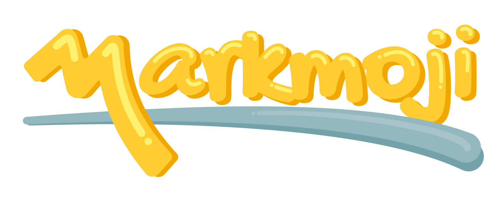

<head><link rel='stylesheet' href='style/style.css'></link></head>

# 

Markmoji extends the [basic markdown syntax](https://www.markdownguide.org/basic-syntax/) using an easy to understand and quickly readable emoji-based syntax, allowing you to create custom HTML elements from just an emoji, a label and a URL.

## Installing
Markmoji is on PyPi! To install, just copy the following into a terminal:

```
pip install markmoji
```

[Click here](https://datatofish.com/install-package-python-using-pip/) for more instructions on what installing from pip means.

## The Syntax
Similar to how basic markdown indicates an image using an exclamation point before a link (``), markmoji syntax uses an emoji beore a link (`🐦[name](url)`), with the emoji dictating the type of HTML element created.

## Python function
To parse markmoji syntax, just use the function `markmoji.markmoji()` with your markdown text as the input. It will return the same text but with any markmoji syntax returned as HTML objects.

## Integration with [`python-markdown`](https://python-markdown.github.io/)
Included in the package are the necessary classes to use markmoji as an extension to `markdown.Markdown`. Here's an example of how you might do it:
```
import markmoji
import markdown as md

# Define some dummy content
content = "🏐[label1](link1)\n🏐[label2](link2)/n🐦[label3](link3)"
# Create markdown processor with markmoji
processor = md.Markdown(extensions=[markmoji.Markmoji()])
# Do actual markdown conversion
content = processor.convert(content)
```

## Contributing
This is all designed with open source contribution in mind! To add your own handlers, check out the file `handlers/handlers.py` to see the existing implementations and some instructions on how to add your own. It's not all that hard to do, I promise!

# Implementations
What kinds of elements are creatable through Markmoji depends on what "handlers" people have made. You can view a list of all handlers [here](./handlers)